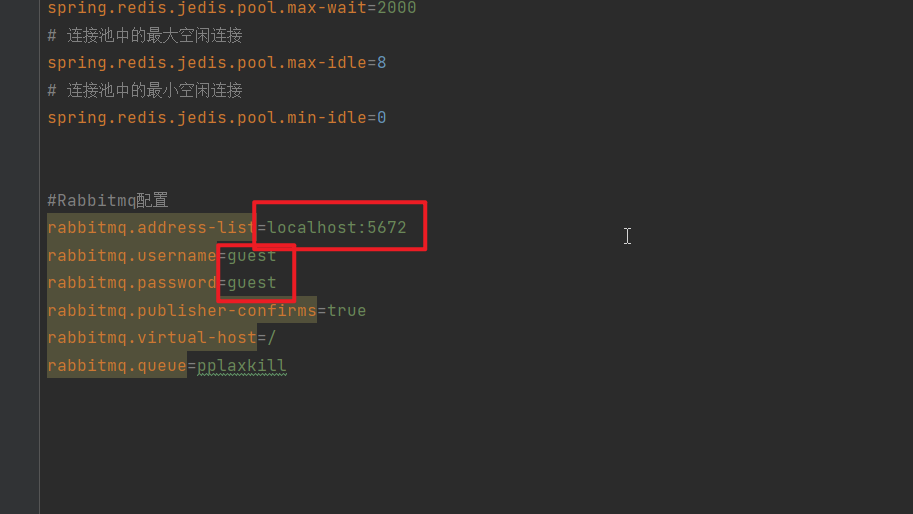

# pplax-kill

## 介绍

Java实现的秒杀网站，使用Spring Boot开发

## 技术栈

* Spring Boot
* MyBatis
* Redis, MySQL
* Thymeleaf + Bootstrap
* RabbitMQ
* ZooKeeper

‍

## 秒杀过程

首先在Redis里进行秒杀。 这里的并发量非常大，抢到后，给与30分钟的时间等待用户付款， 如果用户过期未付款，则Redis库存加1 ，算用户自动放弃付款。

用户付款成功后，后台把付款记录持久化到MySQL中，这个步骤并发量相对小一点，使用数据库的事务解决数据一致性问题

## 流程图

​​

‍

## 后端限流操作

在进行秒杀业务前，先通过Google guava的RateLimiter获取令牌

```java
package xyz.pplax.kill.service.impl;

import com.google.common.util.concurrent.RateLimiter;
import org.springframework.stereotype.Service;
import xyz.pplax.kill.service.AccessLimitService;

/**
 * 通过Google guava的RateLimiter进行限流操作
 */
@Service
public class AccessLimitServiceImpl implements AccessLimitService {

    /**
     * 每秒只发出十个令牌,只有拿到令牌才可以进行秒杀
     */
    private RateLimiter rateLimiter = RateLimiter.create(10);

    /**
     * 尝试获取令牌
     * @return
     */
    @Override
    public boolean tryAcquirePPLAXKill() {
        return rateLimiter.tryAcquire();
    }
}

```

‍

## 如何启动

application.properties

​​

​​​​

​​

以上改成自己的配置
